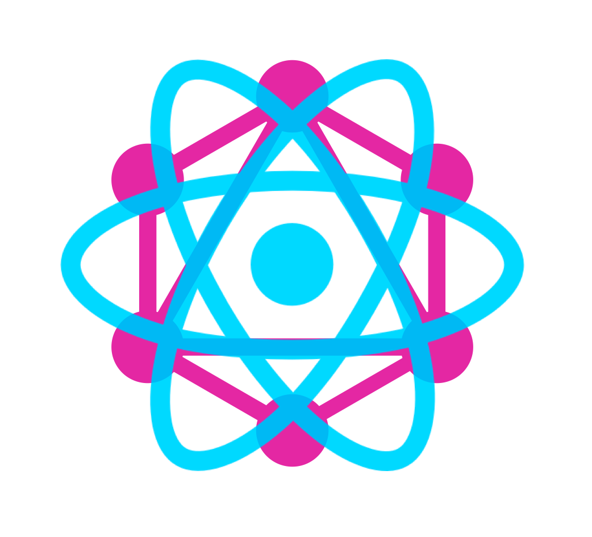

# Disease Analyzer Webapp
A React Based Web app to analyze diseases based on data from a GraphQL endpoint

<div id="top"></div>


<!-- PROJECT LOGO -->
<br />
<div align="center">
  <a href="https://github.com/perugoal1/disease-analyzer-webapp">
    
  </a>

  <h3 align="center">Disease Analyzer Web App</h3>

  <p align="center">
    A React Based Web app to analyze diseases based on data from a GraphQL endpoint
    <br />
    Deployed Web App URL : <a href="https://disease-analyzer-webapp.herokuapp.com/"><strong> https://disease-analyzer-webapp.herokuapp.com/</strong></a>
    <br />
  </p>

  ---

  [](https://github.com/perugoal1/disease-analyzer-webapp/actions/workflows/deploy.yml)
  
</div>


<!-- TABLE OF CONTENTS -->
<details>
  <summary>Table of Contents</summary>
  <ol>
    <li>
      <a href="#about-the-project">About The Project</a>
      <ul>
        <li><a href="#built-with">Built With</a></li>
      </ul>
    </li>
    <li>
      <a href="#getting-started">Getting Started</a>
      <ul>
        <li><a href="#prerequisites">Prerequisites</a></li>
        <li><a href="#development-setup">Development Setup</a></li>
        <li><a href="#steps-to-run-production-build-locally">Steps to run production build locally</a></li>
      </ul>
    </li>
    <li><a href="#features">Features</a></li>
    <li><a href="#license">License</a></li>
    <li><a href="#contact">Contact</a></li>
  </ol>
</details>


<!-- ABOUT THE PROJECT -->
## About The Project

[![Screen Shot][screenshot]](https://disease-analyzer-webapp.herokuapp.com/)

This is a React web application that queries the GraphQL API, processes the response data, and displays a data table and visualisations showing the 10 drug targets that have the highest overall association score with lung carcinoma.


<p align="right">(<a href="#top">back to top</a>)</p>


### Built With

List of frameworks/libraries used in the project.

* [React.js](https://reactjs.org/)
* [GraphQL](https://graphql.org/)
* [Apollo Client](https://www.apollographql.com/docs/)
* [React Bootstrap](https://react-bootstrap.github.io/)
* [Recharts](https://recharts.org/en-US)
* [Express](https://expressjs.com/)

<p align="right">(<a href="#top">back to top</a>)</p>


<!-- GETTING STARTED -->
## Getting Started

Below are the instructions on setting up the project locally.

### Prerequisites

Following software is required to run the project.
* nodejs
  
  Installation Reference: [https://nodejs.org/en/download/](https://nodejs.org/en/download/)

### Development Setup

Run the below commands to start local dev server

1. Clone the repo
   ```sh
   git clone https://github.com/perugoal1/disease-analyzer-webapp
   ```
2. Install NPM packages

   All the js dependencies are listed in `package.json`.
   ```sh
   npm install
   ```
3. Start dev server
   ```sh
   npm run dev
   ```

### Steps to run production build locally

Run the below commands to generate and run production build of the app.

1. Create production build
   ```sh
   npm run build
   ```
2. Start a express server to server the production build.
   ```sh
   npm run start
   ```

<p align="right">(<a href="#top">back to top</a>)</p>


<!-- Features -->
## Features

- [x] Displays data table with 10 rows and show the targets with the highest overall association scores and sorted by overall association score.
- [x] Approved Symbol column, has a link to the relevant target profile page in Open Targets Platform
- [x] Clicking on ‘+’ button in the first column, expands and shows a tab bar that toggles between a bar chart and a radar chart with the individual data type association scores.
- [x] Has a CICD pipleline implemented, which automatically deploys the latest code to Heroku on updates to Master branch. [link](https://github.com/perugoal1/disease-analyzer-webapp/actions/workflows/deploy.yml)

<p align="right">(<a href="#top">back to top</a>)</p>


<!-- LICENSE -->
## License

Distributed under the GNU General Public License v3.0. See `LICENSE` for more information.

<p align="right">(<a href="#top">back to top</a>)</p>


<!-- CONTACT -->
## Contact

Peru - [LinkedIn](https://www.linkedin.com/in/perunthagai-nedunthagaikoe-59b517b4/) - perugoal2@gmail.com


<p align="right">(<a href="#top">back to top</a>)</p>


<!-- MARKDOWN LINKS & IMAGES -->
[screenshot]: images/screenshot.png